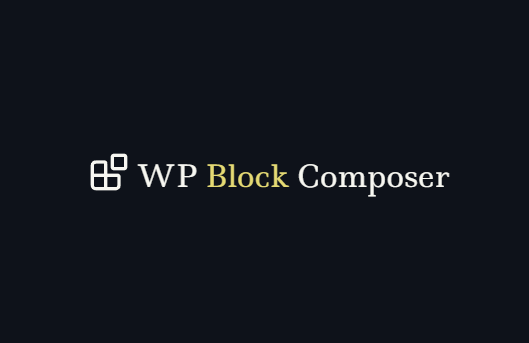

# WP Block Composer

A dynamic WordPress block generation tool for exploring block configurations and generating boilerplate code, built with Vue/Nuxt.

## What It Does

WP Block Composer lets you visually compose the structure of a custom WordPress block by selecting and configuring components, then generates the corresponding boilerplate code.

## Who It's For

- Developers pivoting into custom WordPress Block development who haven't worked much in React
- ACF Block developers looking to move toward native WordPress components
- Experienced developers wanting a boilerplate generator and component explorer

## Important Notes

- Generated blocks work out of the box but are intentionally barebones — styles and additional functionality must be added manually
- Use this tool to explore the wide variety of available WordPress UI components before reaching for an LLM
- Understanding block structure makes it easier to customize the Block Editor through its various APIs

## Resources

- [Getting Started With WordPress Block Development — CSS Tricks](https://css-tricks.com/getting-started-with-wordpress-block-development/)
- [How to Use @wordpress/scripts — Rudrastyh](https://rudrastyh.com/gutenberg/wordpress-scripts.html)
- [Official Docs for @wordpress/create-block](https://developer.wordpress.org/block-editor/reference-guides/packages/packages-create-block/)

## Setup

```bash
pnpm install
```

## Development Server

```bash
pnpm dev
```

Runs on `http://localhost:3000`.

## Production

```bash
pnpm build
pnpm preview
```

Check out the [Nuxt deployment documentation](https://nuxt.com/docs/getting-started/deployment) for more information.
